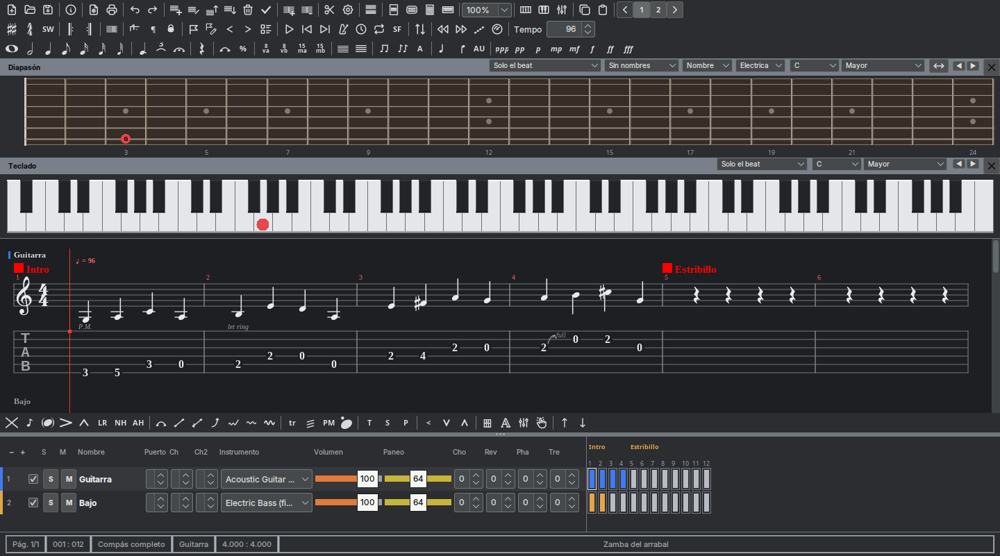
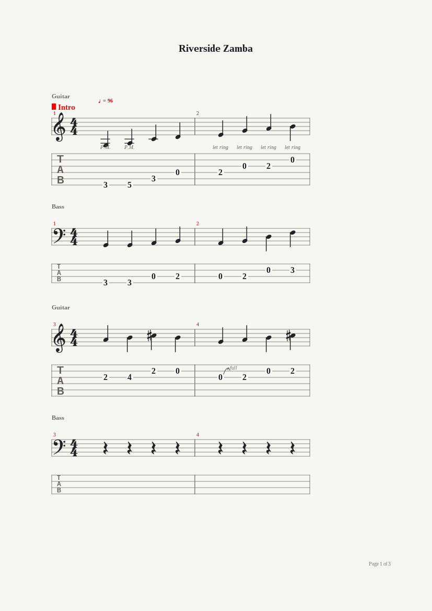
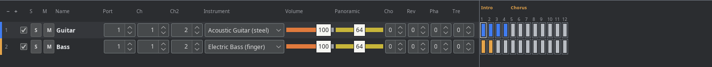

# tabpro

A free, open-source guitar tablature and score editor. Write tab and standard
notation side by side, see the score laid out the way it prints, and hear it
play.



tabpro is modeled on Guitar Pro 5.2: the same toolbar layout, the effects bar
under the score, and the same keyboard shortcuts. It opens Guitar Pro,
TablEdit and PowerTab files, runs anywhere Java 25 does (with a `.deb` for
Debian and Ubuntu), and ships in English and Spanish.

- [Features](#features)
- [File formats](#file-formats)
- [Installation](#installation)
- [Keyboard shortcuts](#keyboard-shortcuts)
- [Building from source](#building-from-source)
- [Not supported yet](#not-supported-yet)
- [Feedback and bug reports](#feedback-and-bug-reports)

## Features

### Writing

- **Tab and staff stay in sync.** Enter a note in either one and it shows up in
  both.
- **Several ways to enter notes:** the computer keyboard (digits for the fret,
  arrows to move), clicking the fretboard or the piano keyboard, or playing a
  connected MIDI instrument.
- **Any number of tracks,** each with its own tuning, string count, capo and
  instrument, and two voices per track. Show them all at once or one at a
  time, switching with the numbered track selector on the toolbar.
- **Retuning keeps your notes.** Change a track's string count and its notes
  move to the new tuning instead of disappearing, so a banjo part becomes a
  guitar part.
- **Your defaults.** New scores start with the tempo, time signature, key
  signature and header you saved as default properties.

### Notation

- Clefs, key signatures, dotted values, stems, beams, rests, accidentals,
  ties and tuplets.
- Guitar techniques: palm mute, let ring, tapping, slap and pop, natural and
  artificial harmonics, vibrato and wide vibrato, trills, tremolo picking,
  strums, pick stroke direction, ghost and dead notes, accents, staccato,
  hammer-ons and pull-offs, all six slide types, bends with an editable curve,
  grace notes, fingering for both hands, free text and chord diagrams.
- Bar structure: repeats with a play count, alternate endings, double bars,
  musical directions (Coda, Segno, Fine and fourteen jumps), markers you can
  edit in place, octave marks (8va, 8vb, 15ma, 15mb) that move the written
  note without changing its pitch, and forced or prevented line breaks.

### Layout

- **Four view modes:** Page, with sheet, margins, header and footer;
  Parchment, a continuous score without page breaks; and Horizontal and
  Vertical Screen, which use all the available space.
- **Zoom from 30% to 200%** in an editable toolbar combo with the usual preset
  values.
- **Printing** with page range and scale, plus export to image and PDF.



### Playback

- **MIDI playback in real bar order,** following repeats, alternate endings
  and jumps such as *D.C. al Coda*.
- **Effects you can hear:** bends and whammy bar along their curves, slides,
  hammer-ons and pull-offs, trills, tremolo picking, harmonics, delayed
  strums, grace notes, fade in and swing.
- **Practice tools:** metronome, count-in, loop with speed trainer, relative
  tempo from ×0.25 to ×2, and step-by-step playback.
- **A playback line follows the music.** Click any bar to jump there without
  stopping, step bar by bar while it plays, and read the current tempo in the
  window title.
- **Mix table changes play back.** Insert them anywhere in the score to fade a
  track out, switch instruments at the chorus, or speed the tempo up over a
  given number of beats.
- **SoundFont support.** Press `F2` to play through the `.sf2` and `.dls`
  banks installed on your system with Gervill, the synthesizer bundled with
  Java. Without a bank, tabpro uses the system synthesizer.
- **WAVE export without a sound card.** Audio is rendered offline, so export
  works even on a machine with no audio device.

### Fretboard and keyboard


- Both show the notes under the cursor and write a note when you click them.
- They follow the active track's tuning, capo and string count.
- Display the current beat, the whole bar, the next beat, the last chord
  diagram or a chosen scale, labeling scale notes by name, interval or degree.
- Four fretboard types, left- or right-handed, with the note under the mouse
  pointer.
- Close either panel from the ✕ on its title bar, choose which toolbars to
  show, swap the score and mix table positions, and color note heads by
  dynamic to read dynamics at a glance.

### Mix table and global view



- **Per-track mixing:** MIDI port; two channels, one for the track and one for
  its effects, so a bend never detunes the clean notes; a General MIDI
  instrument, or a drum kit on percussion tracks; volume and pan with slider
  and number box; chorus, reverb, phaser and tremolo; mute and solo.
  Everything stays editable during playback.
- **The global view** shows one colored row per track under a bar ruler, with
  markers in red and a small silver square on every empty bar. Click any cell
  to jump there.

### Tools

- **Chord window:** generates diagrams for any tuning, names them and suggests
  a fingering you can correct by hand. It remembers the voicing you picked the
  next time that shape comes up. Move the base fret, force or forbid the
  barre, omit chord tones, and keep your favorites in your own library.
- **Scales window:** a built-in scale library, the structure of each scale,
  and a search that finds the scales a range of bars uses, sorted by how many
  notes fall outside each one.
- **Tuner:** by ear string by string, or digital with a microphone.
- **Percussion Assistant** for drum tracks.
- **Wizards** in the Tools menu: let ring, palm mute and dynamics per string
  over a range of bars, bar arrangement, filling with rests, automatic
  fingering, transposition and bar duration checks.
- **Score browser** (`Ctrl+B`): walks a folder and plays each score without
  opening it, a set number of bars each, moving on to the next one by itself.

### Accessibility

- **Works without a mouse.** Menus and dialogs have mnemonics (`Alt` + the
  underlined letter). The mix table sliders, fretboard, keyboard, global view,
  markers, Percussion Assistant, bends and tuner all work from the keyboard
  and show focus. `Ctrl+F6` moves focus from the score to the rest of the
  window.
- **Screen reader friendly.** Every control has an accessible name and
  description in addition to its tooltip. The status bar is split into six
  labeled panels: page, position, bar status and duration, track, and title
  and author.
- **WCAG AA contrast** in both the light and dark palettes.
- **Preferences > Accessibility** adjusts the interface font size, turns on
  high contrast and turns off animations.
- **English and Spanish interface.** Preferences > Language offers Automatic,
  English and Español. Automatic follows the system language; changes apply
  after a restart.

## File formats

| Format | Open / import | Save / export |
|---|:---:|:---:|
| tabpro (`.tabpro`) | ✓ | ✓ |
| Guitar Pro 3, 4 and 5 (`.gp3`, `.gp4`, `.gp5`, `.gtp`) | ✓ | `.gp4` |
| TablEdit (`.tef`) | ✓ | |
| PowerTab (`.ptb`) | ✓ | |
| MIDI | ✓ | ✓ |
| MusicXML | ✓ | ✓ |
| ASCII tab | ✓ | ✓ |
| WAVE | | ✓ |
| Image, PDF | | ✓ |

- **`.tabpro`** is a readable, versioned JSON format that keeps everything:
  effects, ties, tuplets, both voices, bar attributes, track properties,
  header and lyrics.
- **Guitar Pro 4 export** warns you first if the score uses anything the
  format cannot hold.
- **Guitar Pro files are tested against real ones.** Of the 61 files in
  PyGuitarPro's test suite, 60 open; PyGuitarPro cannot open the remaining one
  either. See [how the formats are verified](docs/DEVELOPMENT.md#guitar-pro-compatibility).
- **MIDI import** lists the file's tracks so you can import them one by one or
  merge several into an existing track. **ASCII import** lets you paste and
  fix the tab before it lands on the active track.

> [!NOTE]
> Guitar Pro scores imported with a tabpro version older than 0.17.1 have
> bends at half depth and some grace notes with the wrong transition. Those
> files cannot be repaired: import the original Guitar Pro file again.

## Installation

**Debian and Ubuntu:** download the `.deb` from the
[latest release](https://github.com/gstn-caruso/tabpro/releases/latest) and
install it:

```sh
sudo apt install ./tabpro_0.60.0_all.deb
tabpro
```

tabpro shows up in the applications menu and opens `.tabpro`, `.gp3`, `.gp4`,
`.gp5` and `.gtp` files from your file manager. It needs a Java 25 runtime
with desktop support (`openjdk-25-jre`); the headless runtime is not enough.

**Other systems:** [build from source](#building-from-source) and run the jar
with Java 25:

```sh
java -jar tabpro-app/target/tabpro-app-0.60.0.jar [file]
```

## Keyboard shortcuts

Press `F1` for the full list.

**Writing**

| Key | Action | Key | Action |
|---|---|---|---|
| `0`–`9` | Fret number | `B` | Bend |
| Arrows | Move the cursor | `V` | Vibrato |
| `+` / `-` | Shorter / longer note | `P` | Palm mute |
| `R` | Rest | `I` | Let ring |
| `L` | Tie | `X` | Dead note |
| `/` | Triplet | `O` | Ghost note |
| `H` | Hammer-on / pull-off | `G` | Grace note |
| `S` | Slide | `F` | Fade in |
| `T` | Text | `A` | Chord |

**Playback and windows**

| Key | Action | Key | Action |
|---|---|---|---|
| `Space` | Play / stop | `F9` | Loop / speed trainer |
| `F2` | Sound bank on / off | `F10` | Mix table change |
| `F5` | Score information | `F11` | Color notes by dynamic |
| `F6` | Track properties | `F12` | Preferences |
| `F7` | Instrument | `Ctrl+Tab` / `Shift+Tab` | Next / previous marker |
| `F8` | Page setup | `Ctrl+B` | Browse scores |
| `F1` | Help | `Ctrl+F6` | Move focus out of the score |

Everything else lives in the twelve menus: File, Edit, Bar, Track, Note,
Effects, Markers, Tools, Sound, View, Options and Help.

## Building from source

You need JDK 25 and Maven. From the repository root:

```sh
mvn verify
```

This runs the whole test suite and builds the executable
`tabpro-app/target/tabpro-app-<version>.jar` and the Debian package
`tabpro-app/target/tabpro_<version>_all.deb`.

tabpro is written in Java 25 with Swing and FlatLaf, with icons from
[Tabler Icons](https://tabler.io/icons) and music symbols from the
[Bravura](https://github.com/steinbergmedia/bravura) font. For the module
layout, how the tests run and the release workflow, see
[docs/DEVELOPMENT.md](docs/DEVELOPMENT.md).

## Not supported yet

- **Saving `.gp5` files.** tabpro exports Guitar Pro scores to the Guitar Pro 4
  format, like Guitar Pro 5.2's `File > Export` menu; `.gp5` files are
  read-only for now.

## Feedback and bug reports

Found a bug, a score that does not open or looks wrong, or something from
Guitar Pro 5.2 that tabpro is missing?
[Open an issue](https://github.com/gstn-caruso/tabpro/issues/new). It helps to
include:

- the tabpro version (`dpkg -s tabpro` shows it if you installed the `.deb`),
  your operating system and the output of `java -version`;
- the steps that lead to the problem and what you expected instead;
- the file, when a score fails to open or renders wrong and you can share it.

Feature ideas are welcome too. Take a look at the
[open issues](https://github.com/gstn-caruso/tabpro/issues) first, in case
someone already asked.

## License

[MIT](LICENSE)
