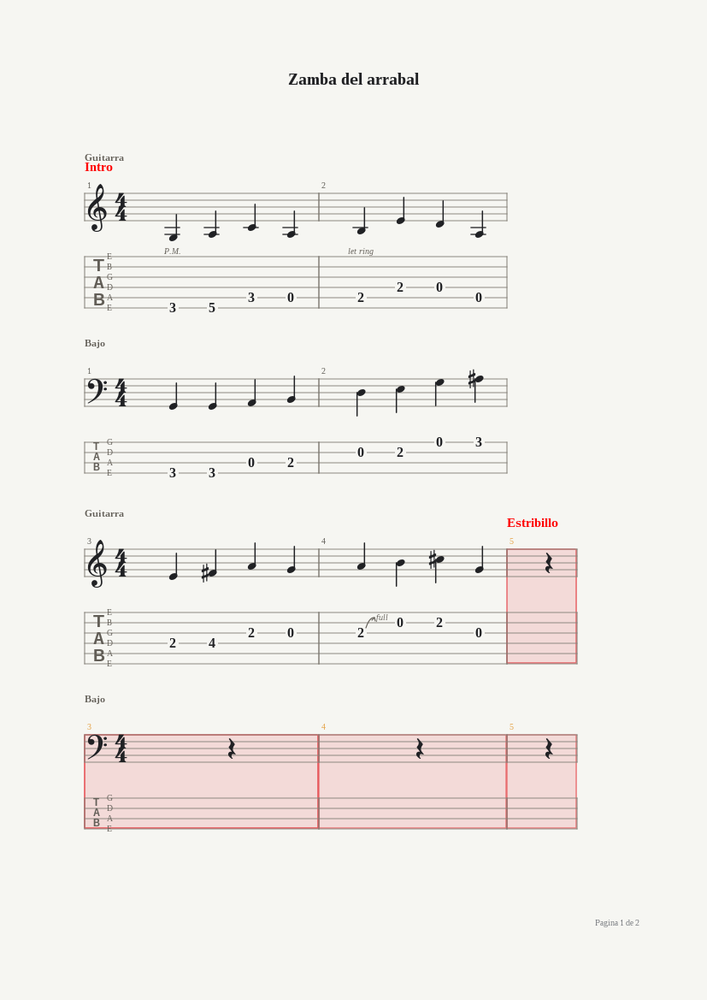
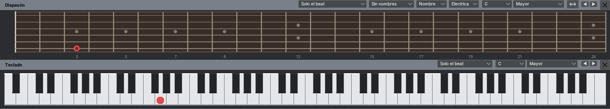
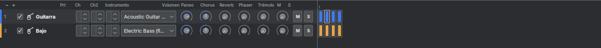

# tabpro

Editor libre de tablaturas y partituras para guitarra, en Java 25 con Swing.
Escribís la música, la ves como en un cancionero publicado y la escuchás sonar.


Está inspirado en Guitar Pro 5.2, del que toma la forma de la pantalla y los
atajos de teclado, con una estética propia, oscura y plana.

## Qué hace

**Escribís en la tablatura y en el pentagrama a la vez.** Lo que ponés en una
aparece en la otra. Se escribe con el teclado —los dígitos son el traste, las
flechas mueven el cursor—, clickeando el diapasón o el piano de arriba, o tocando
un instrumento MIDI conectado.

**Una partitura tiene todas las pistas que quieras**, cada una con su afinación,
su cantidad de cuerdas, su capo y su instrumento. Podés verlas todas juntas o de
a una, y apagar desde la mesa de mezcla las que molestan. Si le cambiás la
cantidad de cuerdas a una pista, las notas se transponen a la afinación nueva en
vez de perderse: una línea de banjo se convierte en una de guitarra.

**La partitura se ve como sale impresa.** Hay modo página con su hoja, márgenes,
encabezado y pie; modo pergamino sin cortes; y dos modos de pantalla que usan
todo el espacio disponible. Con zoom del 30% al 200%.



**Suena.** Reproducción MIDI que respeta el orden real de los compases
—repeticiones, finales alternativos y los saltos tipo *D.C. al Coda*— y los
efectos: bends y palanca con su curva, slides, ligados, trinos, trémolos,
armónicos, rasgueos demorados, notas de adorno, fade in y swing. Con metrónomo,
cuenta regresiva, loop con entrenador de velocidad, tempo relativo de x0.25 a x2
y modo paso a paso. Mientras suena, una línea vertical fina recorre el sistema
marcando dónde va; hacer clic en cualquier compás salta ahí sin frenar el sonido,
los botones de paso a paso pasan a moverse de compás en compás, y el título de la
ventana muestra el tempo real de ese momento.

**Con samples reales, si querés.** `F2` prende el banco de sonidos: tabpro busca
los SoundFont (`.sf2`, `.dls`) instalados en la máquina y los toca con Gervill, el
sintetizador que ya trae Java. Sin banco suena el sintetizador del sistema, como
siempre. Y exporta la partitura a WAVE, que se renderiza sin abrir ninguna línea
de audio: se puede exportar en una máquina sin placa de sonido.

Los cambios de parámetro que se insertan a mitad de partitura suenan de verdad:
bajar el volumen de todas las pistas sobre el final, cambiar de instrumento en el
estribillo o acelerar el tempo, con su transición medida en beats.

## La notación

Clave, armadura, figuras con puntillo, plicas, barras de unión, silencios,
alteraciones, ligaduras, grupos irregulares y **dos voces** por pista.

Sobre eso, los símbolos del guitarrista: palm mute, let ring, tapping, slap y
pop, armónicos naturales y artificiales, vibrato y vibrato amplio, trino, trémolo
de púa, rasgueos, dirección de la púa, notas fantasma y muertas, acentos,
staccato, ligados, los seis tipos de slide, bends con su curva editable, notas de
adorno, digitación de las dos manos, texto libre y diagramas de acordes.

Y la estructura del compás: repeticiones con su conteo, finales alternativos,
doble barra, direcciones musicales (Coda, Segno, Fine y los catorce saltos),
marcadores, octavas (8va, 8vb, 15ma y 15mb, que cambian dónde se escribe la nota
sin tocar cómo suena), y saltos de línea forzados o impedidos para maquetar la
hoja.

## El diapasón y el teclado



Marcan las notas del beat y escriben al clic. Se ajustan solos a la afinación, al
capo y a la cantidad de cuerdas de la pista activa. Muestran el beat solo, el
compás, el próximo beat, el último diagrama de acorde o la escala elegida —y para
las notas de la escala podés ver el nombre, el intervalo o el grado. Cuatro tipos
de diapasón, zurdo o diestro, y la nota que está bajo el mouse.

También podés colorear las cabezas de nota según su intensidad, para leer la
dinámica de un vistazo, elegir qué barras de herramientas ves y cuáles no, e
intercambiar de lugar la partitura y la mesa de mezcla.

## La mesa de mezcla y la vista global



Puerto, los dos canales de la pista —el suyo y el de sus efectos, para que un bend
no le corra la afinación a las notas limpias—, instrumento General MIDI —o kit de
batería, si la pista es de percusión—, volumen, paneo, chorus, reverb, phaser,
trémolo, silenciar y solo. Todo editable mientras suena. Al lado, la vista global:
una fila de color por pista, un cuadradito por compás y la zona de marcadores,
para saltar a cualquier parte de un clic.

## Las herramientas

**La ventana de acordes** genera los diagramas para cualquier afinación, los
nombra, propone la digitación y te deja corregirla a mano —y se acuerda de la que
elegiste para la próxima vez que aparezca esa forma. Podés mover el traste base,
forzar o prohibir la cejilla, omitir notas del acorde y guardarte los que más usás
en una biblioteca propia.

**La ventana de escalas** trae su biblioteca, muestra la construcción de cada
escala y encuentra la que usa un rango de compases, ordenada por cuántas notas se
le escapan.

Más el **afinador** —el de oído, cuerda por cuerda, y el digital con micrófono—,
el **asistente de percusión** y los asistentes del menú Herramientas: let ring,
palm mute y dinámica por cuerda sobre un rango de compases, acomodar los compases,
completar con silencios, digitación automática, transportar y revisar la duración
de los compases.

## Archivos

Cada partitura nueva arranca con el tempo, el compás, la armadura y los datos de
encabezado que hayas dejado como propiedades por defecto.

Guarda en `.tabpro`, un JSON legible y versionado que conserva todo: efectos,
ligaduras, grupos irregulares, las dos voces, los atributos de cada compás, las
propiedades de pista, los datos del encabezado y la letra.

Abre archivos `.gp3`, `.gp4`, `.gp5` y `.gtp`, y exporta al formato de Guitar
Pro 4 (avisando antes qué se pierde, si la partitura usa algo que ese formato no
soporta).

El lector y el escritor de `.gp4` están verificados contra PyGuitarPro y contra
los dieciséis archivos auténticos de su suite de pruebas, no contra archivos que
hubiera escrito tabpro: un lector y un escritor que comparten la misma suposición
equivocada se dan la razón entre ellos, así que el oráculo tiene que venir de
afuera. Tres de esos dieciséis ni siquiera abrían antes de esa comprobación.

> **`.gp5` todavía no tiene esa verificación, y sabemos que hay archivos
> auténticos que no abre.** Es otra generación del formato y la comprobación
> contra archivos ajenos cubrió la anterior. Se está midiendo cuántos abren y
> cuántos no; hasta que eso esté, tomá la lectura de `.gp5` como que puede
> fallar. Si te pasa, el archivo no se toca: tabpro no lo sobrescribe.

> Si importaste partituras de Guitar Pro con una versión anterior a la 0.17.1,
> sus bends quedaron a la mitad de profundidad y algunos adornos con la
> transición cambiada. No hay forma de arreglarlos desde el archivo ya
> importado: volvé a importar el original.

Importa archivos `.tef` de TablEdit.

Importa y exporta MIDI, tablatura ASCII y MusicXML, con sus ventanas: la de MIDI
lista las pistas del archivo y deja importarlas de una o fusionar varias sobre una
pista existente; la de ASCII deja pegar y corregir la tablatura antes de
importarla sobre la pista activa.

Exporta también la partitura como imagen y como PDF, y la imprime eligiendo el
rango de páginas y la escala.

## Instalación

**Debian / Ubuntu:** bajá el `.deb` de la última
[release](https://github.com/gstn-caruso/tabpro/releases) e instalalo:

```sh
sudo apt install ./tabpro_0.21.1_all.deb
tabpro
```

Queda en el menú de aplicaciones y se asocia a los archivos `.tabpro`, `.gp3`,
`.gp4`, `.gp5` y `.gtp`: abrir cualquiera desde el escritorio abre tabpro con esa
partitura. Necesita una JRE 25 con entorno gráfico (`openjdk-25-jre`); la variante
*headless* no alcanza.

**Cualquier sistema con Java 25:**

```sh
java -jar tabpro-app-0.21.1.jar [archivo]
```

## Atajos

Los dígitos escriben el traste, las flechas mueven el cursor, `+` acorta la figura
y `-` la alarga, `R` pone un silencio, `L` liga, `/` hace un tresillo, `H` un
ligado, `S` un slide, `B` un bend, `V` vibrato, `P` palm mute, `I` let ring, `X`
nota muerta, `O` nota fantasma, `G` nota de adorno, `T` texto, `A` acorde, `F`
fade in, `Espacio` reproduce.

`F2` prende y apaga el banco de sonidos, `F5` abre la información de la partitura, `F6` las propiedades de la pista, `F7`
el instrumento, `F8` la configuración de página, `F9` el loop, `F10` los cambios
de parámetro, `F11` las notas con dinámica, `F12` las preferencias. `Ctrl+Tab` y `Shift+Tab` saltan entre
marcadores. `F1` abre la lista completa.

Los doce menús —Archivo, Editar, Compás, Pista, Nota, Efectos, Marcadores,
Herramientas, Sonido, Ver, Opciones y Ayuda— llevan todo lo demás.

## Lo que todavía no está

La exportación a `.gp5` —tabpro exporta a `.gp4`, que es lo que pide el manual;
los archivos `.gp5` por ahora sólo se leen—. La importación de PowerTab.

## Cómo está hecho

Java 25, Maven multi-módulo, Swing con FlatLaf (tema propio, claro y oscuro),
Gson para el formato propio y `javax.sound.midi` para la reproducción y la
captura.

Las dependencias van en una sola dirección hacia `tabpro-core`; la interfaz habla
con el formato y con MIDI sólo a través de los puertos `ScoreFiles`,
`ScoreExchange` y `Player`, definidos en core. `tabpro-format` y `tabpro-midi` no
se conocen entre sí: `ScoreExchange` lo implementan los dos por mitades —la
notación uno, el sonido el otro— y `tabpro-app` las compone.

- `tabpro-core` — el modelo de la partitura (inmutable), la sesión de edición con
  deshacer y rehacer, la notación, la armonía, los asistentes y la reproducción.
- `tabpro-format` — el formato propio, la notación ajena que se lee y se escribe
  (importar MIDI, ASCII y MusicXML) y el lector de `.gp3/.gp4/.gp5/.gtp`.
- `tabpro-midi` — reproducción, captura y el sonido a archivo: exportar `.mid` y
  `.wav`.
- `tabpro-ui` — la interfaz: partitura, diapasón, teclado, percusión, mesa de
  mezcla, vista global, barra de estado, menús, barras de herramientas y las
  ventanas de diálogo.
- `tabpro-app` — `main`, el tema, el cableado —incluida la composición del
  intercambio— y el empaquetado.

```sh
mvn verify
```

Genera `tabpro-app/target/tabpro-app-<versión>.jar` (ejecutable) y
`tabpro-app/target/tabpro_<versión>_all.deb`.

Todo comportamiento entra por un test que falla primero. Cada cambio va en una
branch, se abre un PR contra `main` y el CI (`mvn -B verify`, headless) es el gate
para mergear. Un tag `vX.Y.Z` en `main` dispara el release, que construye el
`.deb` y lo publica.

## Licencia

[MIT](LICENSE)
